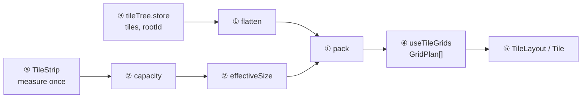

# REF — node 카탈로그 타일 UI 구현 (코드 구조 · 파일 매핑 · 구현 결정)

> 2026-09-29 코드 구현 착수와 함께 `REF-node-ui-layout.md`에서 하위 주제(규칙 vs 코드) 기준으로 분할 — **규칙은 layout/projection/overview에, 그 규칙을 어떤 파일·함수로 옮겼는지는 여기에.** 이력 → `history/node-ui-impl.md` / 배치 규칙 → `REF-node-ui-layout.md` / 화면 크기별 표시 → `REF-node-ui-projection.md` / 전체보기·내비 → `REF-node-ui-overview.md` / 렌더 컴포넌트·헤더 내비 코드 → `REF-node-ui-render.md` / 현재 진행 → `CURRENT.md`.

## 역할 분담 (2026-09-29)
코드 대부분은 Claude가 작성하고, **로직 구조는 사용자와 먼저 합의한 뒤** 쓴다(구조 합의 → 코드 순서).

## 층 구조 (합의 2026-09-29)
| 층 | 파일 | 책임 | 상태 |
|---|---|---|---|
| ① 순서·채우기 | `feature/widget/util/tileOrder.util.ts` | 여는 관계 트리 → 순서 리스트 → 2×2칸 채우기 | 작성 완료 |
| ② 화면 판정 | `feature/widget/util/tileSplit.util.ts` | 칸 수·표시 크기·최소 크기·스냅 오프셋 | 작성 완료 |
| (공용 타입) | `feature/widget/util/tile.type.ts` | `TileNode`/`TileSize`/`Capacity`/`GridPlan` 등 | 작성 완료 |
| ③ 트리 상태 | `feature/node/store/tileTree.store.ts` (provide/inject) | `tiles`·`rootId` + `openFolder`/`navigate`/`addTerminal`/`close`/`resize` | 작성 완료 |
| ④ 파생 | `feature/node/store/tileGrids.store.ts` (`provideTileGrids(area)`/`useTileGrids`) | 측정 area → `capacity` → `flatten` → `pack` (computed) | 작성 완료 |
| ⑤ 렌더 | `TileWorkspace` > `TileStrip` > `TileLayout` > `Tile` > `TileFrame` (+ `TileNav` → 헤더) | 그리기만(로직 없음) | 최소판 + 칼럼 스냅 + **헤더 내비 작성 완료**(더미 내용, 전체보기 없음) → `REF-node-ui-render.md` |

## 구현 결정 (합의 2026-09-29)
| 결정 | 내용 | 이유 |
|---|---|---|
| 렌더 = CSS grid 좌표 배치 | `pack`이 타일마다 `c,r,cw,ch`를 내고, `Tile`이 `grid-column/row`에 그대로 넣음. `cols=1`이면 `grid-template-columns: 1fr` | 기존 `Tile.vue`(span 방식)와 맞음. 빈칸은 비워 두면 됨 |
| Band 구조 버림 | 시안의 `toBands`(Band flex 렌더용)는 포팅 안 함. `axis`만 남겨 정보 줄 표시용으로 씀 | 좌표 배치에선 렌더에 불필요 |
| 측정 = `TileStrip`에서 한 번 | Grid 영역 = strip 크기 - padding - Grid 하단 정보 줄. `TileLayout`(Grid 하나)이 자기를 재지 않음 | **재발 방지**: 1칼럼 폭 Grid가 자기 폭을 재면 절반 폭 → 가로 1칸 판정 → 전체 재배치 → 다시 넓어짐 → 진동 |
| 유틸 위치 (⑦ 해소) | `feature/widget/util/` (`TileLayout.vue` 옆) | 타일 전용 로직이라 `REF-util`(범용 유틸) 대상 아님 |
| 트리 보관 (Q4) | 서버 저장(⑪) 전까지 provide/inject 메모리만, 새로고침 시 초기화 | 필요하면 localStorage만 얹기 |
| 첫 범위 (Q2) | 구현 순서 1(유틸)·2(트리 상태)·3(렌더러)까지, 타일 내용은 더미 | ⑪·②(ProcessDialog 다중 인스턴스) 미설계 |

## ① ② 유틸 API (2026-09-29 작성)
| 함수 | 입력 → 출력 | 시안 대응 |
|---|---|---|
| `flatten(tiles, rootId)` | `Record<id, T extends TileNode>` → `[{tile, depth}]` (폴더 → 실행한 프로세스 → 연 하위 폴더, 재귀) | `TileOrder.flatten` 그대로 |
| `pack(list, sizeOf)` | 순서 리스트 + 이 화면 표시 크기 함수 → `GridPlan[]` = `{ items:[{tile,c,r,cw,ch}], empty, cols, axis }` | `TileOrder.toGrids` — Band 대신 좌표, `empty` 추가, `trim` 인자 제거(항상 전부 줄임) |
| `capacity(area, th = TILE_THRESHOLD)` | Grid 영역 → `{x, y}` 각 1\|2. 기준치 `728 / 560` | 동일 |
| `effectiveSize(size, cap)` | 용량 1칸 축의 0.5 → 1 | 동일 |
| `minSize(cap)` | 새 타일 크기 = 이 화면 최소 단위 | 시안의 `minSize(v)`를 유틸로 올림 |
| `columnStops(gridWidth, cap, tileGap, cols = 2)` | 스냅 오프셋 px (`cols=1` 또는 가로 1칸이면 `[0]`) | 동일 |

- `empty` = 빈 슬롯 목록. **Band 단위로 모음**: 통째로 빈 Band는 슬롯 하나(row면 `2×1`, column이면 `1×2`), 아니면 빈 칸마다 `1×1`. `cols=1`이면 오른쪽 칼럼은 빈칸으로 안 셈.
- `axis`: 가로 1.0 타일 있으면 `row`, 세로 1.0 타일 있으면 `column`, 1×1 타일 하나면 `null`, 둘 다 없으면 `column`. 가로 1.0과 세로 1.0은 한 Grid에 공존 불가.
- `pack`은 제네릭(`T`에 제약 없음) — `sizeOf`만 넘기면 됨. 앞쪽 빈칸 채우기는 열린 질문 ⑧(같은 Grid 앞쪽 빈칸 채우기)의 시안 가정 그대로.
- 제외: 시안의 `primPhys`/`flexDir`(Band flex 렌더용).

## ③ 트리 상태 스토어 (2026-09-29 작성)
| 항목 | 모양 / 시그니처 | 비고 |
|---|---|---|
| `Tile` | `TileNode` + `parent: string \| null` (= 연 폴더 타일) | id = `crypto.randomUUID()` |
| `FolderTile` | `+ nodeId: number \| null` | 지금 보는 노드, `null` = 루트 목록 |
| `TerminalTile` | `+ nodeId: number, uid: string` | **참조만** — 상태·출력은 트리에 안 둠 |
| 상태 | `tiles`(readonly), `rootId` | 시작 = 기본 폴더 타일 1개(0.5×0.5) |
| `openFolder(parentId, nodeId, size)` / `addTerminal(parentId, nodeId, uid, size)` | 부모 `kids` 끝에 추가, id 반환 | 부모가 폴더 타일이 아니면 throw |
| `navigate(tileId, nodeId)` | 폴더 타일 `nodeId`만 교체 | 이름 클릭 = 타일 안 이동 |
| `close(tileId)` | 터미널 제거 / 폴더는 하위 폴더를 자기 자리로, 터미널은 `adopted`로 부모 `kids` 끝에 | 루트는 무시 |
| `resize(tileId, size)` | `size` 교체 | |

- **스토어는 화면·API를 모른다**: `size`는 호출부가 ④의 `minSize(cap)`로 넘김. `execProcess` 성공 → `addTerminal`. 합의 때의 `exec` 이름을 `addTerminal`로 바꿈(실행은 밖에서).
- **루트 = 0.5×0.5 저장**: `effectiveSize`가 1칸 축의 0.5를 1.0으로 보므로 어느 화면에서든 최소 단위 → `cap` 없이 초기화 가능.
- **위치 = `feature/node/store/`**: nodeId·uid를 참조하는 도메인 상태라서. 순수 유틸(`feature/widget/util/`)과 구분.
- `TileNode.kids`는 `ReadonlyArray` — readonly로 노출한 `tiles`를 `flatten`에 그대로 넘기기 위해. 스토어는 배열 교체로 갱신.
- **A(닫기와 kill, 확정 2026-09-29)**: 실행 중 터미널은 닫기 비활성, kill 후(COMPLETED/FAILED)에만 닫기 — 타일 없이 도는 process 방지. **UI가 막는다**(스토어 `close`는 process 상태를 모름).
- **넘겨받은 프로세스(`adopted`)**: `close`가 터미널에 `adopted: true`를 붙여 부모 `kids` 끝에, 하위 폴더는 닫힌 자리에 넣는다. 순서 규칙(직접 실행 → 넘겨받음)은 **`flatten` 한 곳에만** 둔다(스토어가 `kids` 순서로 맞추는 방식은 규칙이 두 곳에 나뉘어 기각). 필드는 `TileNode.adopted?: true`. 결과 표 → `REF-node-ui-layout.md` "타일 닫기".

## ④ Grid 파생 (2026-09-29 작성)
| 구분 | 이름 | 타입 | 출처 / 쓰는 곳 |
|---|---|---|---|
| 입력 | 트리 | `tiles`, `rootId` | `useTileTree()` |
| 입력 | `area` | `Ref<Area \| null>` (스토어가 생성) | `TileStrip`이 측정해 기록(strip - padding - Grid 하단 정보 줄) |
| 입력 | `stripEl`/`scrollX`/`viewW` | ref | `TileStrip`이 기록(요소 등록·scroll·resize) |
| 출력 | `geometry`/`view` + `goGrid`/`goColumn` | computed / 함수 | 헤더 내비 `TileNav` |
| 출력 | `cap` | `Capacity` | 크기 팝업(1칸 축 0.5 비활성), 전체보기 버튼 아이콘만 여부 |
| 출력 | `order` | `OrderedTile<Tile>[]` | 순번·깊이·`(1)(2)` 표기 |
| 출력 | `grids` | `GridPlan<Tile>[]` | 렌더 |
| 출력 | `newSize` | `minSize(cap)` | 실행/새 타일 버튼 → `openFolder`/`addTerminal` |

- 측정은 ⑤ `TileStrip`. 전부 computed → 트리 조작·크기 변화 시 자동 reflow.
- **B(전달 방식)** = provide/inject. 헤더 내비 단계에서 provide 위치를 `TileStrip` → `TileWorkspace`(strip·내비 공통 부모)로 옮기고, `AppHead`까지는 안 올림 — F(헤더 전달 방식) = Teleport (→ `REF-node-ui-render.md`).
- **DOM 접촉은 `scrollTo` 하나**: 측정·스크롤 기록은 `TileStrip`, 스토어는 등록된 `stripEl`에 `scrollTo`만.
- **C(측정 전 상태)** = `area === null`이면 `grids = []`(안 그림) — 기본 cap 가정 후 측정 직후 튀는 것 방지.
- 실행 배선(`execProcess` → `addTerminal`)은 authKey(인스턴스 선택, roster 미구현) 필요 → ⑤ 이후.
- 출력에 `posOf`(순번)·`instanceOf`(같은 노드 실행의 `(n)`)도 둠 — 둘 다 `order` 파생 표시값.

## ⑤ 렌더 · 헤더 내비 → `REF-node-ui-render.md` (2026-09-29 분할)
컴포넌트 표·칼럼 스냅·GAP 통일·브라우저 확인·헤더 내비(F(헤더 전달 방식)/G(화살표 = 칼럼 이동)) 전부 그쪽.

## 프로토타입 (2026-09-29, 규칙 승인됨) — layout에서 이동
- **구현 기준 = "타일링 시안 전체보기"(최신 v10)** (https://claude.ai/artifact/WPLqzcUKmTNwJp58Fi3zuM, 2026-09-29 사용자 확정) — 원본 시안 + 빈 칼럼 전부 줄이기 + 전체보기가 모두 들어 있음. 상세 → `REF-node-ui-overview.md` "구현 기준 시안". 원본·비교 시안은 기록용.
- 원본 시안: https://claude.ai/artifact/Tz9DeJd2B1Un5hm2GjFyLY — 화면 크기 입력/끌어서 조절, 기준치 입력, 예시(처음 / 순서 예시 / 중첩 폴더 / 2×2 / 크기 섞기), 실행·새 타일·크기 조절·kill·닫기, 타일 순서 목록, 여는 관계 트리 JSON. 노드·출력은 예시 데이터.
- **두 기기 동시 표시(2026-09-29(4))**: 같은 트리를 PC(1440×900)·폰(390×844) 두 프레임에 같은 배율로 나란히 그림. 어느 쪽에서 동작해도 두 화면이 함께 재배치되고, 자리가 바뀐 타일에 점선 + `G1→G2`/`자리 이동` 표시.
  - 관찰: 폰에서 실행하면 새 타일이 폰 최소 단위(1.0×0.5)로 저장되므로 **PC에서는 가로바**가 되어 뒤 타일들을 다음 Grid로 민다(교차 영향, 사용자가 수용).
- 시안 HTML 원본은 Artifact `read`로 받는다. 링크는 user vault `user/links.md`에도 있음.
- 시안에서 임의로 정한 것(미확정): 분할 트리거 = 폴더 타일의 실행/새 타일 버튼(열린 질문 ①(분할 UX)). 타일 닫기 규칙은 2026-09-29 확정(→ `REF-node-ui-layout.md` "타일 닫기").

## 구현 착수 이력 (2026-08-19) — layout에서 이동
Phase1 첫 코드로 `feature/widget/component/TileLayout.vue`(범용 CSS grid 래퍼, column/row/gap prop) 신설 — 위 모델과는 미연동(정적 데모, `pages/index.vue`). 상세 → `REF-widget.md`/`history/widget.md`. ⑤ 렌더 단계에서 `GridPlan`을 받도록 확장 예정.

## 확인된 환경 사실 (2026-09-29)
- **⑥(Grid 크기 확보)**: `AppHead` = `VAppBar`(Vuetify 레이아웃, fixed), `AppBody` = `VMain`이 `--v-layout-top` padding으로 비킴 → `#Index{height:100%}`는 `v-main` 높이가 확정돼야 먹음. ⑤ 렌더 단계 첫 확인 지점.
- `index.html` viewport 메타에 `interactive-widget` 없음(⑮ 모바일 가상 키보드 대응 시 추가).
